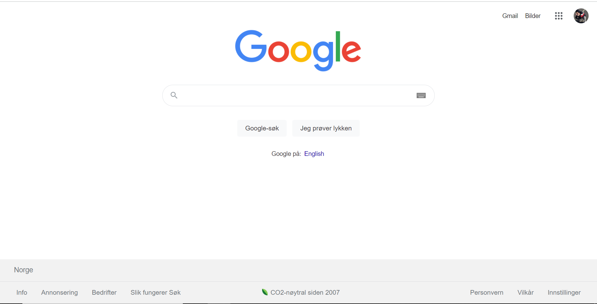

# VSC 1 

## Beskrivelse
Prosjekt har som mål å lage Google homepage innen html og css.

## Problemstilling

- Jeg ble bedt om å oppgradere Google's home-page.

## Prosjekt skjelett 

```
Survey-form (folder)
|
|----readme.md                   
|----solution
        |----index.html  
        |----style.css   
```

## Forventet resultat



## Objektiv

Bygge en indentisk google Home nettside:[Survey Form](https://kewinsh.github.io/VSC1/)

### På slutten av prosjektet skal følgende emner dekkes;

- CSS Colors-Border Properties

- CSS Margins-Padding

- CSS Flexbox

- CSS Properties for Texts-Font Families-Links


## Trinn til løsning
  
- Trinn 1: Last ned prosjektrepo på Github

- Trinn 2: Lag prosjektmappe for lokal offentlig repo på PC-en din

- Trinn 3: Lag Google Page
	
- Trinn 4: Push applikasjonen din inn i din egen offentlige repo på Github

## Notater

- Du kan bruke HTML og CSS for å fullføre dette prosjektet.

## Ressurser

-  [Background Image Url](https://kewinsh.github.io/VSC1/)


## Lykke til med koding!

